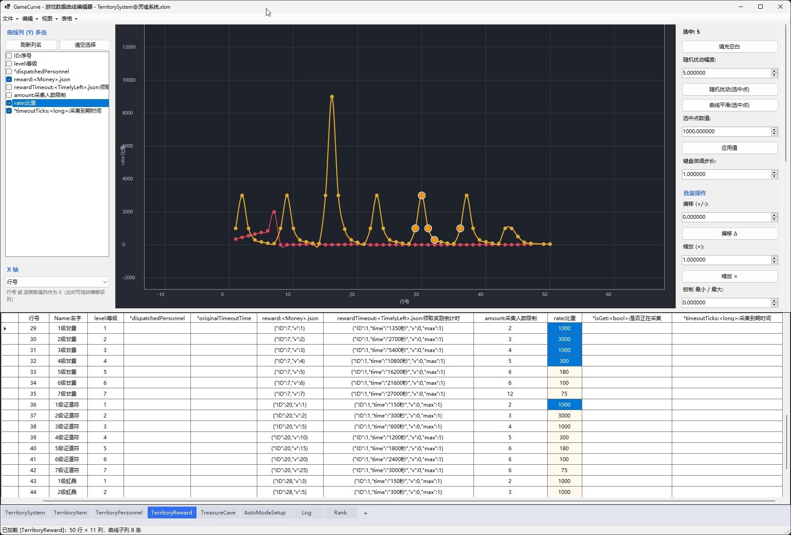

# GameCurve - 游戏数据曲线编辑器 QQ5069099



面向游戏策划和配置人员的 Excel 曲线编辑工具。打开 `.xlsx / .xlsm` 工作簿后，勾选一个或多个曲线子列，将其可视化为曲线；支持拖动点、框选、多选、`Shift` 范围选择、键盘微调，并把修改写回 Excel 对应单元格。反向亦然：在下方表格中手工编辑单元格，曲线也会同步更新。

表格区采用 Excel 式编辑体验：单击列名选中整列、单击行头选中整行、按住行头上下拖动可多选整行，右键菜单可直接删除选中的多行；单元格点击只选中，键入或 `F2` / 双击进入编辑。

## 项目结构

解决方案为单个 `.NET 9` Windows Forms 项目，按职责划分为 `Excel`（OpenXml 数据层）、`Models`（数据模型）、`Services`（核心逻辑）、`Ui`（界面）四层。

```text
GameCurve/
├─ GameCurve.sln                    # 解决方案文件
├─ GameCurve.csproj                 # 项目配置：net9.0-windows / WinForms / OpenXml
├─ GameCurve.csproj.user            # 用户级项目配置
├─ Program.cs                       # 程序入口：--test 自测 / 启动主窗体
├─ TestHarness.cs                   # 无界面自测：验证读取、列识别、曲线点、回写等
├─ .gitignore                       # 忽略 .vs / .vscode / obj
│
├─ Excel/                           # OpenXml 读取与回写层
│  ├─ WorkbookModel.cs              # 工作簿入口：枚举表、加载快照、列/表顺序、批量写回
│  ├─ SheetStructure.cs             # 行列“平移式”结构编辑：插入/删除行、插入/删除列
│  ├─ HeaderParser.cs               # 解析表头：字段名 / 类型 / 显示名 / 数值列判定
│  └─ CellHelper.cs                 # 单元格读写辅助：共享字符串、数值解析、引用换算
│
├─ Models/                          # 数据模型
│  ├─ ColumnMeta.cs                 # 单列元信息：列索引、字母、名称、类型、数值性
│  ├─ CurveColumnOption.cs          # “子曲线”来源：整列 / 数组元素 / JSON v
│  ├─ CurveData.cs                  # CurvePoint 数据点与 CurveSeries 曲线序列
│  └─ SheetSnapshot.cs              # 工作表快照：网格文本、列元信息、行列对齐
│
├─ Services/                        # 核心逻辑
│  ├─ CurveFit.cs                   # 最小二乘拟合：线性/多项式/指数/对数/幂/S型/高斯/正弦/有理
│  ├─ CurveMath.cs                  # Catmull-Rom 样条、移动平滑、归一化、钳制
│  ├─ Statistics.cs                 # 数值统计：数量/最小/最大/平均/中位/总和/标准差
│  └─ SubCurveHelper.cs             # 子曲线拆分与回写：数组列 / .range / .json
│
├─ Ui/                              # WinForms 界面
│  ├─ MainForm.cs                   # 主窗体：布局、曲线列选择、表格编辑、批量/撤销/保存
│  ├─ MainForm.resx                 # 主窗体资源
│  ├─ CurveEditor.cs                # 自定义曲线控件：网格、多曲线、拖点/框选/缩放平移
│  ├─ FitDialog.cs                  # 高级拟合对话框：参数固定/正则化/混合/锚点
│  └─ SplashForm.cs                 # 加载画面：标题 + 跑马灯进度条
│
├─ Properties/                      # 发布配置
│  └─ PublishProfiles/
│     ├─ FolderProfile.pubxml       # win-x64 文件夹发布档案
│     └─ FolderProfile.pubxml.user
│
├─ test/excel/                      # 测试样例工作簿（.xlsm 带宏）
│  ├─ Base@全局数据.xlsm
│  ├─ BuffSystem@Buff系统.xlsm
│  ├─ GameSystem@游戏系统.xlsm
│  ├─ GuideSystem@引导系统.xlsm
│  ├─ ShopSystem@商城系统.xlsm
│  └─ TaskSystem@任务系统.xlsm
│
├─ bin/                             # 构建产物（含多种配置/运行时目录）
├─ obj/                             # 构建中间产物（已忽略）
└─ publish/                         # 自包含发布目录（可直接运行的 GameCurve.exe）
```

**依赖**：`DocumentFormat.OpenXml 3.1.1`，用于读取与写回 `.xlsx / .xlsm`，写回时仅修改目标单元格，保留原工作簿格式、公式、共享字符串与宏（`vbaProject.bin`）。

## 技术栈

- 语言与运行时：C# / .NET 9（`net9.0-windows`）
- UI：Windows Forms（`UseWindowsForms=true`）
- 配置文件处理：DocumentFormat.OpenXml 3.1.1
- 发布形态：`win-x64`，支持自包含单文件打包，无需目标机器安装 .NET

## 运行

已发布自包含程序，无需安装 .NET：

```powershell
publish\GameCurve.exe [工作簿路径]
```

不传参数时，启动后通过“文件”菜单选择文件；传入路径会直接打开该文件。

## 从源码构建

需要 .NET 9 SDK 和 Windows 桌面运行时：

```powershell
dotnet build -c Release
dotnet publish GameCurve.csproj -c Release -r win-x64 --self-contained true -p:PublishSingleFile=true -p:IncludeNativeLibrariesForSelfExtract=true -o publish
```

若使用 `Properties/PublishProfiles/FolderProfile.pubxml`，也可在 Visual Studio 中直接发布到 `bin\Release\net9.0-windows\publish\win-x64\`。

## 无界面自测

程序内置 `--test` 自测模式，无需打开界面即可验证读取、列识别、结构编辑与回写，常用于发布前回归：

```powershell
GameCurve.exe --test [工作簿路径]
```

指定第二个参数可切换测试文件，默认使用 `test/excel/` 下的样例。子命令：

| 子命令 | 用途 |
| --- | --- |
| `--render` | 渲染第一条数值列为 PNG（`--render <文件> <输出.png>`） |
| `--structure` | 验证行列插入 / 删除、内存快照操作与宏保留 |
| `--subcurve` | 验证子曲线列空白格不写回、有值格可读改写 |
| `--columnorder` | 验证列显示顺序的持久化 |
| `--columnwidth` | 验证列宽读写 |
| `--sheetorder` | 验证工作表显示顺序的持久化 |
| `--addsheet` | 验证新建工作表 |
| `--renamesheet` | 验证工作表重命名 |

例如：

```powershell
publish\GameCurve.exe --test --render test\excel\Base@全局数据.xlsm temp.png
```

## 支持的曲线数据

- **普通数值列**：`<long>`、`<int>`、`<double>`、`<float>` 等标量列，或按数据占比推断的数值列。
- **数值数组列**：`<float[3]>`、`<double[]>`、`<int[]>`、`<long[]>` 等，支持固定/动态长度，按数组元素拆成多条子曲线，例如 `uiBody[0]`、`uiBody[1]`、`uiBody[2]`。
- **JSON 数值数组**：`<double[]>.json` 等，按实际数组元素拆分。
- **JSON 对象数组**：`<Attr[]>.json` 等，数组中每个含 `v` 的对象生成一条子曲线，例如 `attrs[ID=1]`。
- **JSON 单一对象**：对象含 `v` 时生成一条子曲线；不含 `v` 的对象/数组默认不生成曲线。
- **区域列**：`.range` 结尾的数值列按数组列处理。
- **整型数组取整**：`int/long/short/byte/uint/ulong` 等整型数组在修改写回时会舍入为整数，不会写小数。
- **动态长度**：数组长度不按表头 `[N]` 固定，按整列实际数据动态扫描；某行缺少对应位置时跳过该点。
- **隐藏内容**：名称/表头含 `111` 的列和 Sheet 不会显示，避免干扰。

## 启动画面与加载

打开工作簿、切换工作表等解析较慢的操作会自动放到后台线程执行，主界面保持响应，并显示带跑马灯进度条的加载画面。后台完成后再刷新曲线与表格，避免界面看起来“卡死”。

## 使用说明

### 曲线列

- 启动或打开工作表后，默认**不勾选任何曲线**，由用户手动勾选。
- 左侧“曲线列 (Y) 多选”列出所有可用的子曲线，勾选后会叠加显示。
- 列表项文字过长时，悬停会显示完整名称提示。
- “清空所有选择”按钮可一键取消全部勾选。
- 点击表格单元格时，左侧列表会把对应的列选中并滚动到可见位置，方便决定是否勾选，但不会自动勾选。

### X 轴

- 默认使用**排除表头后的数据行序号**（从 1 开始），与表格“行号”列保持一致，而不是物理 Excel 行号。
- X 轴下拉框同样支持普通数值列、数组子曲线和 JSON v 子曲线。
- 选择子曲线作为 X 轴后，拖动点时新 X 值会写回对应数组元素或 JSON 对象。

### 曲线交互

- 单击选点，`Ctrl+单击` 多选切换，空白处拖拽框选，`Ctrl+拖框` 追加选择，`Ctrl+A` 全选，`Esc` 取消。
- **`Shift+单击` 范围选择**：先点选起点，再按住 `Shift` 点终点，即可选中两点之间的整段点；也可以先用 `Ctrl` 选中多个点，再用 `Shift` 扩选。
- 拖拽选中点移动；多选时整体平移。
- `↑↓←→` 微调，`Shift` 步长 ×10，`Ctrl` 步长 ×0.1。
- 滚轮缩放，中键按住平移画布。
- 按住空格后，鼠标在画布任意位置按下并拖动，都会移动当前选中的点，避免点不准时误操作。
- 双击曲线区或“自动适配视图”恢复视野。
- 右键菜单可设为当前编辑列、隐藏曲线、批量操作、曲线拟合、刷新、导出 PNG 等。

### 曲线拟合

选中点后在“拟合”区选择线型与多项式次数，可“预览”或“应用”：

- **预览**：在主图上以青色虚线叠加拟合曲线，不动数据点。
- **应用**：把选中点吸附到拟合线上，并保留拟合曲线预览。
- 拟合结果在下方显示公式、`R²` 与 `RMSE`，判断拟合好坏。

支持的线型包括：直线、多项式（次数 2–8）、双参指数、三参指数、对数、幂函数、S 型（Logistic）、高斯、正弦、有理函数。其中 S 型、高斯、正弦、三参指数、有理函数等非线性线型使用 Levenberg-Marquardt 优化求解参数。

**“高级拟合...”** 提供更多精确控制：

- **任意参数固定/覆盖**：每个线型的所有参数（如 S 型的 `L/U/k/m`、高斯的 `a/b/c/d`、多项式的 `c0..cn`）可留空自动拟合，或填入数值强制固定。
- **多项式正则化**：调节光滑度，抑制高阶多项式过拟合。
- **拟合范围**：仅选中点或整列全部点。
- **应用方式**：直接吸附到拟合线，或按比例混合（0–100%，控制点向拟合线移动的程度）。
- **锚定端点**：拟合后保持首尾点不动，避免高阶曲线两端甩动。
- **预览**：实时叠加拟合曲线，并回显公式、`R²`、`RMSE` 与每个参数的拟合值。

也可从右键菜单选择“拟合选中点”，一键选取线型并应用。

### 表格联动

- 选择曲线点时，表格会垂直滚动到对应行，并水平滚动到对应数据列，选中对应单元格而不是整行。
- 表格多选单元格时，会同步选中曲线上对应的点；从表格点击单元格不会来回跳动。
- 表格列宽可手动拖动调整，第一行列名水平居中。
- 表格中手工修改单元格，对应曲线实时更新；当前编辑列修改会进入撤销/未保存记录。
- **像 Excel 一样编辑**：点击单元格只选中（不再一进就编辑），键入或 `F2`/双击进入编辑；按住鼠标可框选多个单元格。
- **剪贴板**：`Ctrl+C` 复制选中区域、`Ctrl+X` 剪切、`Ctrl+V` 粘贴到当前单元格（默认从活动格向右下填充）、`Delete` 清除选中单元格内容；一次多格操作撤销时按一条记录回退。
- 新添加的列（通过列名右键“插入列”或顶部“表格”菜单）默认居中对齐，方便直接输入内容。

### 表格结构与 Excel 式选择

- **Excel 式整列/整行选择**：
  - 单击列名（表头）选中整列。
  - 单击行头选中整行；按住行头并**上下拖动**可框选多行，松开后保持多行选中。
  - 光标停在两个行头之间的**行高调节区**拖拽时只调整行高，不会误触整行选中。
- **批量删除多行**：选中多行后，在行头右键选择“**删除选中的 N 行**”即可一次性删除；若右键落在未选中的行上则退化为删除该单行。
- **列排序**：按住列名（表头）左右拖动即可调整显示顺序；“行号”列固定在最左侧不被拖走。
- **就近改名**：双击列名，直接在表头位置输入新名字，按 `Enter` 提交、`Esc` 取消，不弹窗（模仿 Excel）。
- **插入行/列**：在列名右键选择“在左侧/右侧插入列”，在行号或单元格右键选择“在上方/下方插入行”，或使用顶部“表格”菜单；插入位置后续行/列整体平移。
- **删除行/列**：在行号或列名上右键选择“删除当前行/列”，或使用“表格”菜单，数据与对应曲线点一并移除。
- **内容对齐**：在列名右键选择“内容对齐”可切换该列内容为 左 / 中 / 右 对齐；列名（表头）始终水平居中。
- **列宽持久化**：拖动列边调整列宽后，保存时会写回 Excel，下次打开保持该宽度。
- 这些结构改动与普通单元格编辑一样，点击“保存”或按 `Ctrl+S` 后写回 Excel，原列样式、公式与宏（`vbaProject.bin`）保留。
- 列排序属于“视图排列”，只影响当前会话的显示顺序，不会改动 Excel 文件里的物理列顺序，以免破坏数据列的映射关系。

### 工作表管理

- 底部标签栏显示所有工作表，点击标签即可切换。
- 点击最右侧“+”按钮新建工作表。
- **双击**标签直接改名（不弹窗）。
- 按住标签左右拖动可调整标签顺序，顺序会持久化保存。
- 名称含 `111` 的 Sheet 不显示。

### 保存

- 默认关闭“自动保存”，改动需点击“保存”或按 `Ctrl+S` 写回 Excel。
- “自动保存”开启后，拖点/按键调整会延迟自动写回。
- 切换工作表或关闭程序前，若有未保存改动会弹出确认。
- 保存只修改被编辑的单元格，保留原工作簿格式、公式、共享字符串和宏（`vbaProject.bin`）。
- 顶部“文件”下拉菜单包含“保存”“另存为”“自动保存”与“导出 PNG”等；保存时会一并写回单元格改动、行列结构改动、列对齐、列宽与工作表顺序等。

### 批量与撤销

- 支持设为值、偏移、缩放、钳制、整列平滑、归一化、随机扰动，以及上述曲线拟合。
- 右侧面板显示当前编辑列的统计信息（数量、最小/最大/平均/总和等）。
- `Ctrl+Z / Ctrl+Y` 撤销/重做普通标量编辑；数组/JSON 子曲线编辑会写回整格文本。
- **数组/JSON 子曲线列不自动补充空白**：这类列的点来自单元格内容拆分，空白必须手工在单元格中填入（JSON 数组/对象）。填充空白、拟合“整列每格/仅选中点(含空)”等曲线操作会自动跳过空单元格，不会把空白格自动改为 JSON；当单元格被清空时，对应的曲线点也会一并移除。

## 说明

- Excel 正被打开且独占锁定时，工具可能暂时无法写入，状态栏会提示。
- 大表（数千行）自动降级为直接连线，保持流畅。
- 文件处理基于 DocumentFormat.OpenXml。
